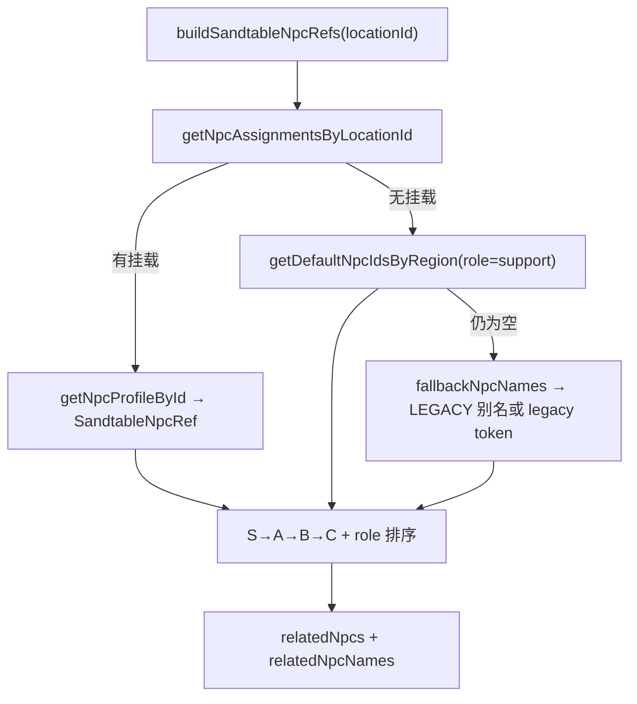

# 协同地图 NPC 分级配置系统

本文档说明沙盘 `/locations` 右侧详情面板中结构化 NPC 的数据来源、解析优先级与兼容策略。

## 分级说明（S / A / B / C）

| 等级 | 含义 | 典型角色 |
|------|------|----------|
| **S** | 决策层 | 业主总经理、项目总负责人、总承包项目经理 |
| **A** | 关键执行 | 协调专员、生产经理、总监理工程师 |
| **B** | 专业支撑 | 档案管理员、材料员、窗口经办人 |
| **C** | 现场/临时 | 楼层施工员、班组长、兜底占位 NPC |

等级越高，在详情面板中排序越靠前。

## 角色类型（LocationNpcRole）

| role | 展示标签 | 含义 |
|------|----------|------|
| `primary` | 主责 | 该地点主要对接人 |
| `regulator` | 监管 | 审批、监督、验收类角色 |
| `support` | 协同 | 配合推进的次要角色 |
| `blocker` | 阻力 | 可能设置条件或制造冲突 |
| `temporary` | 临时 | 阶段性出现的角色 |

同级 NPC 按 `primary > regulator > support > blocker > temporary` 排序。

## 数据文件

| 文件 | 职责 |
|------|------|
| `src/data/npcProfiles.ts` | 95 个可复用 NPC 档案（姓名、职衔、等级、诉求等） |
| `src/data/locationNpcAssignments.ts` | 地点 → NPC 挂载（含 role / level / note） |
| `src/data/regionNpcDefaults.ts` | 六大区无专属挂载时的默认 NPC |

原始策划表：`天穹_分区沙盘NPC分级配置表.xlsx`（本地参考，手工转换为 TS）。

## 解析流程



入口函数：`src/game/sandtableNpcResolver.ts` → `buildSandtableNpcRefs`。

沙盘展示引擎在 `buildRealNode` / `buildSyntheticNode` 中调用，结果写入 `SandtableLocationNode.relatedNpcs` 与 `relatedNpcNames`。

## 地点挂载规则

1. **真实地点**（`owner_*`、`site_*`、`gov_*` 等）：`locationId` 对齐 `MapLocation.id`。
2. **沙盘 synthetic 节点**（`area_*`）：`locationId` 对齐 `locationSandtableAreas` 中的 `id`。
3. **楼层 4F–10F**：共用同一组 NPC profile，仅 `locationId` 不同（如 `area_site_4f` … `area_site_10f`）。
4. **区域兜底**：无 assignment 的 synthetic 节点使用 `regionNpcDefaults` 中该区默认 NPC。

## relatedNpcNames 兼容

- `SandtableLocationNode.relatedNpcNames` **保留**，由 resolver 从结构化 NPC 提取 `name` 列表。
- 事件系统 `triggerNpcNames` 仍匹配 `MapLocation.relatedNpcNames`（**未改动**）。
- 旧字符串可通过 `LEGACY_NPC_NAME_ALIASES` 映射到 profile：

| 旧名称 | profile id |
|--------|------------|
| 甲方代表 | `owner_project_director` |
| 监理单位 | `chief_supervisor` |
| 总承包单位 | `contractor_project_manager` |
| 消防专家 | `fire_pump_room_engineer` |
| 设计院 | `design_lead` |
| 供应商 | `supplier_representative` |
| 商户/运营团队 | `merchant_representative` |
| 物业公司 | `property_engineering_manager` |
| 质监站 | `quality_supervision_officer` |
| 专业分包 | `subcontractor_lead` |

无法匹配 profile 的旧名称生成 fallback token：`npcId = legacy_<slug>`，`level = C`，`role = support`。

## 后续任务 / 剧情引用

- 任务与事件模板应优先引用 **profile id**（如 `owner_project_director`），而非仅依赖展示名。
- `locationNpcAssignments` 中的 `taskHooks` / `eventHooks` / `note` 为策划备注，暂未接入运行时。
- Payload `npcs` collection 与 `content.ts` 中 `NPCS` 保持独立，本次未修改。

## Payload 后台同步

前端 `npcProfiles.ts` 为权威数据源，后台通过脚本 upsert 到 Payload `npcs` collection：

```bash
npm run sync:npcs
```

首次或 schema 变更后需先启动 dev 访问 `/admin`，让 Payload 完成 SQLite 表结构迁移，再执行同步。

**Collection 新增字段：** `slug`（profile id）、`title`、`level`、`faction`、`personality`、`agenda`、`helpsWith`、`blocksWhen`、`riskTags`。

**保留兼容：** `payloadSeed` 仍会写入 10 条旧版泛称 NPC（「甲方代表」「监理单位」等），供 `MapLocation.relatedNpcNames` 与内容健康检查匹配；95 条具名 profile 按 `slug` 单独维护。

转换逻辑见 `src/lib/npcProfilePayload.ts`。

## UI 展示

`/locations` 右侧详情使用 `SandtableNpcList` 组件，每条卡片展示：

- 姓名、职衔
- 等级·角色标签（如 `S·主责`）
- agenda 摘要（最多 2 行）
- 默认最多 5 条，按 resolver 排序
